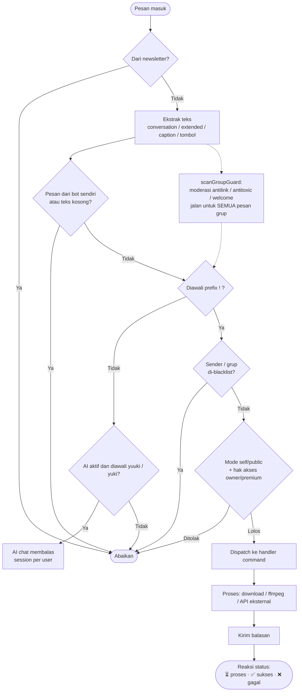
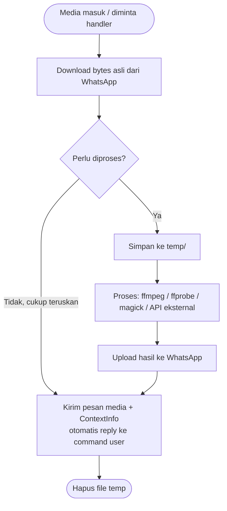
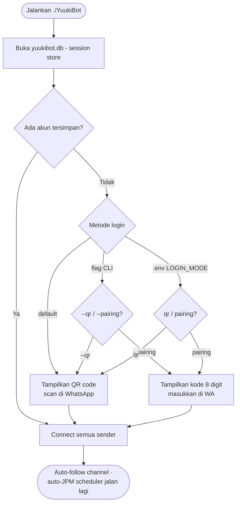

# YuukiBot

Bot WhatsApp multi-fitur berbasis Go ([whatsmeow](https://github.com/tulir/whatsmeow)): pencarian media, konversi file, edit gambar/video, sticker AI, AI chat, broadcast JPM, tools, hingga panggilan audio/video dengan multi-sender. Dijalankan sebagai binary tunggal — semua aset (termasuk QRIS donasi) sudah ter-embed di dalamnya.

> **Closed source.** Repo ini hanya berisi binary hasil compile dan dokumentasi. Source code tidak disertakan.

## Fitur Utama

| Kategori | Contoh Command | Fungsi |
|---|---|---|
| Umum | `!menu`, `!ping`, `!info`, `!sticker`, `!donasi`, `!contributor` | Navigasi menu (4 versi tampilan), cek status, buat sticker, QRIS donasi, daftar kontributor |
| AI Chat | `!ai`, `yuuki <pertanyaan>` | AI chat Yuuki: `!ai on/off` (owner), semua user ngobrol via `yuuki`/`yuki`, session per user (`!ai list`/`load`/`new`) |
| Search | `!yts`, `!wiki`, `!kbbi`, `!lyrics`, `!pinterest`, `!bingimage` | Cari video, artikel, definisi, lirik, gambar |
| Tools | `!tr`, `!qr`, `!ss`, `!barcode`, `!tempmail`, `!whatmusic`, `!ipinfo` | Translate, QR/barcode, screenshot web, identifikasi lagu, lookup IP |
| Image | `!hd`, `!hdvid`, `!removebg`, `!blur`, `!cap`, `!wanted` | Perjelas gambar/video, hapus background, efek gambar |
| Konversi | `!tomp3`, `!toimg`, `!togif`, `!tourl`, `!tofile`, `!resend`, `!rvo` | Konversi media, upload ke URL, kirim ulang tanpa kompres |
| Sticker | `!tenor`, `!sai`, `!brat` | Cari sticker, jadikan sticker AI, buat sticker brat |
| Grup (moderasi) | `!jaga`, `!antilink`, `!antitoxic`, `!welcome`, `!setwelcome`, `!warn`, `!warnlist`, `!resetwarn` | Jaga grup: peringatkan link/kata kasar, sambut member baru (pesan custom), warn 3x = kick otomatis — config persist antar restart |
| Grup (manajemen) | `!close`/`!open`, `!add`, `!kick`, `!promote`/`!demote`, `!tagall`, `!hidetag`, `!setname`, `!setdesc`, `!setppgc`, `!linkgc`, `!revoke`, `!infogc`, `!out` | Kelola grup: kunci/buka chat, tambah/kick member (multi), naik/turun admin, tag semua, ubah nama/deskripsi/foto, link undangan, info grup, bot keluar |
| JPM Broadcast | `!jpm`, `!jpmht`, `!jpmch`, `!autojpm`, `!stopjpm`, `!bljpm` | Broadcast ke semua grup/saluran (owner): mode basic/hidetag/channel/update/auto, jeda antar grup, blacklist per fitur, auto-broadcast terjadwal |
| Saluran | `!getidch`, `!upch`, `!kirim` | Ambil ID saluran dari link (semua user), posting & kirim konten saluran |
| Alight Motion | `!am-send`, `!am-aktif`, `!amkey` | Aktivasi akun via magic link; key kedaluwarsa -> diarahkan beli (10k/bln), ganti key sendiri via `!amkey <apikey>` tanpa restart |
| Audio/Call | `!play`, `!skip`, `!stopcall`, `!antrian`, `!prank` | Streaming lagu/video ke panggilan (owner/premium) |
| Sender | `!addsender`, `!ls` | Kelola akun penelpon tambahan (owner) |
| Owner | `!bl`, `!clear`, `!self`, `!public`, `!setmenu`, `!ap`, `!dp`, `!uploadgh` | Blacklist, mode bot, manajemen akses |

Daftar lengkap semua command: ketik `!allmenu` di WhatsApp.

Fitur otomatis bawaan:

- **Auto-JPM lanjut sendiri** setelah restart kalau sebelumnya aktif.
- **Sambutan menu personal** — `!menu` menyapa pengirim (@mention di grup, tanpa tag di PM) lengkap dengan role (Owner/Premium/User).

## Requirements

| Kebutuhan | Versi | Fungsi |
|---|---|---|
| Binary `YuukiBot` | - | Bot itu sendiri (tidak butuh runtime Go) |
| ffmpeg + ffprobe | terbaru | Proses video/audio: `!hdvid`, `!tomp3`, kompres, dll |
| ImageMagick (`magick`) | terbaru | Proses gambar: `!hd`, `!blur`, efek |
| yt-dlp | opsional | Download YouTube (`!play`, `!tt`). Tanpa ini bot pakai API fallback |
| Go | 1.25+ | Hanya untuk build dari source |

### Instalasi Dependensi (Ubuntu/Debian)

```bash
sudo apt update
sudo apt install -y ffmpeg imagemagick

# yt-dlp (opsional — untuk download YouTube yang lebih stabil)
sudo curl -L https://github.com/yt-dlp/yt-dlp/releases/latest/download/yt-dlp \
  -o /usr/local/bin/yt-dlp
sudo chmod +x /usr/local/bin/yt-dlp
```

### Instalasi Go (hanya untuk build)

```bash
sudo apt install -y golang-go
# atau unduh dari https://go.dev/dl — butuh Go 1.25+
```

## Konfigurasi (.env)

Semua setting bisa diatur lewat file `.env` **tanpa build ulang**. Salin contoh lalu sesuaikan:

```bash
cp .env.example .env
nano .env
```

| Variabel | Default | Fungsi |
|---|---|---|
| `OWNER_NUMBER` | bawaan config | Nomor yang bot anggap owner |
| `CREATOR_NUMBER` | ikut owner | Nomor creator (`shell`, `addowner`) |
| `BOT_NUMBER` | bawaan config | Nomor bot (info & default pairing) |
| `LOGIN_MODE` | `qr` | Metode sambung pertama: `qr` atau `pairing` |
| `PAIRING_NUMBER` | `BOT_NUMBER` | Nomor tujuan pairing saat `LOGIN_MODE=pairing` |
| `MTZ_API_KEY` | bawaan config | API key Alight Motion (bisa diganti kapan saja via `!amkey`) |

Catatan:

- Tanpa `.env` pun bot tetap jalan dengan default bawaan.
- Environment asli (shell/systemd/docker) selalu menang atas `.env`.
- Flag CLI (`--qr` / `--pairing 628xxx`) selalu menang atas `LOGIN_MODE`.

## Menjalankan

```bash
./YuukiBot
```

Pertama kali dijalankan, metode login mengikuti `LOGIN_MODE` di `.env` (default: QR code di terminal — scan dengan WhatsApp > Perangkat Tertaut). Session tersimpan di `yuukibot.db`, jadi scan/pairing hanya sekali.

Sender tambahan (akun penelpon):

```bash
./YuukiBot --qr                 # login sender baru via QR
./YuukiBot --pairing 628xxx     # login sender baru via kode pairing 8 digit
```

## Struktur File

```text
YuukiBot            binary utama (semua aset ter-embed)
.env                konfigurasi deployment (opsional — lihat .env.example)
yuukibot.db         session WhatsApp (sqlite) — jangan dihapus
database/           data runtime JSON:
                    owner.json, premium.json, blacklist.json,
                    group_state.json   (config jaga grup + warn),
                    ai_state.json      (status & session AI chat),
                    jpm.json           (setting JPM + auto-broadcast),
                    am_key.json        (API key Alight Motion hasil !amkey)
temp/               cache file sementara (dibersihkan otomatis / !clear)
uploads/            hasil upload !uploadgh
```

## Alur Kerja

### Alur pesan masuk



### Alur media (foto/video/audio)



### Alur login



## Kontributor

Terima kasih kepada semua yang telah berkontribusi pada pengembangan YuukiBot:

| Kontributor | Kontak |
|---|---|
| kyu ganteng imut | [t.me/kyugaperawan](https://t.me/kyugaperawan) · [t.me/kyunotdev](https://t.me/kyunotdev) · [t.me/raramasihkyu](https://t.me/raramasihkyu) |
| Rijalganzz | [github.com/RIJALGANZZZ](https://github.com/RIJALGANZZZ) |
| Yamzzdep | [github.com/Yamzzdev](https://github.com/Yamzzdev) |
| Ryuhan | [github.com/ryuhandev](https://github.com/ryuhandev) |

In-game juga bisa lihat lewat tombol **🏆 TQTO** di menu (`!menu`) atau ketik `!contributor` / `!tqto`.

## Developer

| | |
|---|---|
| Developer | **RIflxz** |
| GitHub | [github.com/Riflxz](https://github.com/Riflxz) |

## Lisensi

Closed source. Hak cipta milik pemilik bot. Tidak boleh didistribusikan ulang atau dimodifikasi tanpa izin tertulis.
